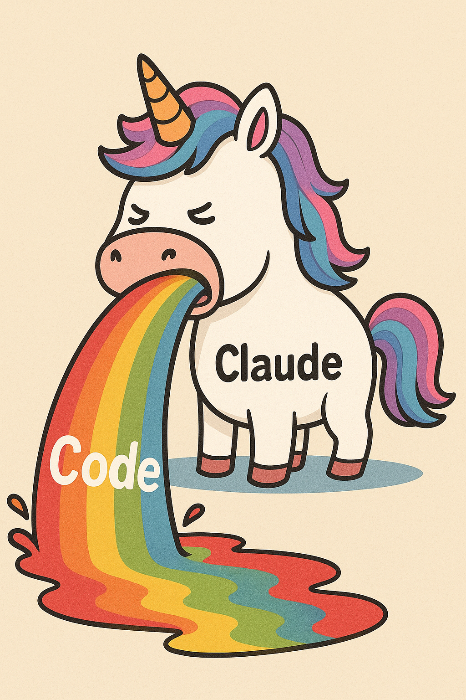

# SC Hauling Assistant

A PyQt6 desktop application for Star Citizen players to streamline hauling missions. Capture mission screenshots, extract data via AI vision APIs, manage your hauling contracts, and optimize delivery routes.

## Features

### Mission Capture & Extraction
- **Screen Region Capture**: Select and capture mission objectives directly from your screen
- **AI-Powered Data Extraction**: Uses Claude (Anthropic) or OpenRouter vision APIs to extract structured mission data from screenshots
- **Image Adjustments**: Fine-tune brightness, contrast, and gamma for better OCR results
- **Batch Processing**: Process multiple screenshots at once from the Screenshot Parser tab

### Mission Management
- **Active Mission Tracking**: View and manage your current hauling contracts
- **Mission Details**: Track rewards, availability timers, cargo types, pickup/delivery locations
- **Status Tracking**: Missions marked as active, completed, or expired
- **Persistent Storage**: Missions saved locally with automatic backups

### Route Optimization
- **VRP Solver**: Vehicle Routing Problem algorithms optimize your delivery route
- **Ship Profiles**: Configure cargo capacity for different ships (Hull A/B/C, Freelancer, etc.)
- **Pickup-Delivery Constraints**: Ensures cargo is picked up before delivery
- **Capacity Management**: Routes respect your ship's cargo limits
- **Multiple Algorithms**: Choose from nearest neighbor, 2-opt, or dynamic regret-based optimization

### Cloud Sync
- **Scan Database**: Store historical mission scans in the cloud
- **Discord Authentication**: Secure sync via Discord OAuth
- **Cross-Device Access**: Access your mission history from anywhere

### User Experience
- **Dark Theme**: Modern dark UI designed for extended sessions
- **Global Hotkeys**: Capture and save missions without switching windows
- **Location Autocomplete**: Smart autocomplete for Star Citizen locations across Stanton, Pyro, and Nyx systems
- **Configurable**: Customize API providers, hotkeys, UI settings via config file

## Installation

### Prerequisites
- Python 3.10 or higher
- Windows (primary platform, may work on Linux/macOS with adjustments)

### Setup

1. Clone the repository:
```bash
git clone https://github.com/yourusername/pySCHaulingAssistant.git
cd pySCHaulingAssistant
```

2. Create a virtual environment:
```bash
python -m venv venv
venv\Scripts\activate  # Windows
# source venv/bin/activate  # Linux/macOS
```

3. Install dependencies:
```bash
pip install -r requirements.txt
```

4. Set up API keys (choose one):
```bash
# For Anthropic Claude
set ANTHROPIC_API_KEY=your-api-key

# For OpenRouter
set OPENROUTER_API_KEY=your-api-key
```

5. Run the application:
```bash
python main.py
```

## Configuration

Edit `config.json` to customize:

- **API Provider**: Switch between `anthropic` and `openrouter`
- **API Model**: Choose which vision model to use
- **Hotkeys**: Configure global keyboard shortcuts
- **UI Settings**: Adjust canvas height, window title, auto-switch behavior
- **Route Planner**: Set default ship and optimization algorithm

## Usage

### Capturing Missions

1. Open the **Capture** tab
2. Click "Select Region" and drag to select your mission objective area in Star Citizen
3. Press your capture hotkey (default: Shift+PrintScreen) or click "Capture"
4. Review the extracted mission data in the validation form
5. Click "Add to Hauling" to save the mission

### Planning Routes

1. Add missions from the Capture tab or import from the Scan Database
2. Open the **Route Planner** tab
3. Select your ship profile to set cargo capacity
4. Click "Optimize Route" to generate an efficient delivery order
5. Follow the stop-by-stop instructions with cargo tracking

### Global Hotkeys

| Hotkey | Action |
|--------|--------|
| Shift + PrintScreen | Capture screen region and extract mission |
| Shift + Enter | Add current mission to hauling list |

Hotkeys can be customized in `config.json`.

## Project Structure

```
pySCHaulingAssistant/
├── main.py                 # Application entry point
├── config.json             # User configuration
├── missions.json           # Active mission storage
├── requirements.txt        # Python dependencies
├── src/
│   ├── api_client.py       # AI API integration
│   ├── config.py           # Configuration loader
│   ├── domain/
│   │   └── models.py       # Core data models (Mission, Route, Stop)
│   ├── services/
│   │   ├── vrp_solver.py   # Route optimization algorithms
│   │   └── ...
│   ├── ui/
│   │   ├── main_window.py  # Main application window
│   │   ├── capture_tab.py  # Screen capture interface
│   │   ├── hauling_tab.py  # Mission management
│   │   ├── route_planner_tab.py  # Route optimization UI
│   │   └── ...
│   └── location_data/      # Star Citizen location databases
└── cloudflare-worker/      # Optional cloud sync backend
```

## Dependencies

- **PyQt6** - Desktop UI framework
- **Pillow** - Image processing
- **requests** - HTTP client for API calls
- **OR-Tools** - Google's optimization library for VRP solving
- **pynput** - Global hotkey support
- **filelock** - Thread-safe file operations
- **keyring** - Secure credential storage

## License

This project is provided as-is for personal use by Star Citizen players.

## Contributors

### Claude Code (Anthropic)
AI pair programming assistant that helped develop this application.


